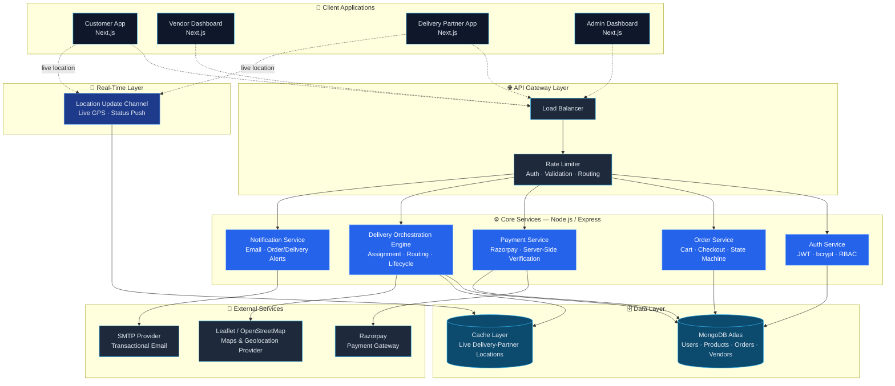

<p align="center">
  
</p>

<p align="center">
  <b>Production-Grade Multi-Vendor E-Commerce, Logistics &amp; Real-Time Delivery Management Platform</b>
</p>

<p align="center">
  
  
  
  
  
  
  
  
  
</p>

<p align="center">
  
  
  
  
  
</p>

<p align="center">
  <a href="#-executive-summary">Executive Summary</a> •
  <a href="#-problem-statement">Problem Statement</a> •
  <a href="#-system-architecture">Architecture</a> •
  <a href="#-system-design">System Design</a> •
  <a href="#-role-based-modules">Modules</a> •
  <a href="#-order--delivery-lifecycle">Order Lifecycle</a> •
  <a href="#-security--authentication">Security</a> •
  <a href="#-tech-stack">Tech Stack</a> •
  <a href="#-database-design">Database</a> •
  <a href="#-production-engineering-standards">Engineering Standards</a> •
  <a href="#-future-scope">Roadmap</a> •
  <a href="#-author">Author</a>
</p>

---

## 🧭 Executive Summary

**SnapCart** is a cloud-native, production-grade **multi-vendor e-commerce and logistics platform** that unifies four distinct operational roles — Customer, Vendor, Delivery Partner, and Administrator — into a single, real-time commerce ecosystem.

Where many e-commerce projects stop at "browse, cart, checkout," SnapCart extends the system boundary into **live logistics**: order approval workflows, delivery-partner assignment, geolocation-based tracking, and payment verification — engineered with the same architectural discipline used by large-scale commerce and logistics organizations.

| Pillar | What It Means Here |
|---|---|
| 🏗️ **Three-Tier Architecture** | Clean separation of presentation, application, and data layers |
| 🚚 **End-to-End Logistics** | Order approval → delivery assignment → live tracking → delivery confirmation |
| 🔐 **Security-First Auth** | JWT sessions, bcrypt hashing, role-based access control |
| 📍 **Real-Time Geolocation** | Leaflet + OpenStreetMap-powered live delivery tracking |
| 💳 **Verified Payments** | Razorpay integration with server-side payment verification |

---

## ❗ Problem Statement

Traditional local retail businesses commonly face:

- Lack of online presence
- Manual, error-prone inventory management
- Inefficient order processing
- Poor delivery coordination
- Limited customer engagement channels
- No real-time order visibility
- Absence of centralized business analytics

**SnapCart addresses these gaps** by unifying customers, vendors, delivery personnel, and administrators inside one centralized, real-time digital platform.

---

## 🎯 Project Objectives

| Role | Core Objectives |
|---|---|
| 🛍️ **Customer** | Browse & search products, place secure orders, pay online, track deliveries in real time, receive notifications |
| 🏪 **Vendor** | Manage listings & inventory, process orders, monitor sales performance, generate revenue reports |
| 🚴 **Delivery Partner** | Receive assigned orders, view customer locations, update delivery status, complete deliveries efficiently |
| 🛡️ **Administrator** | Manage users & vendors, monitor transactions, approve orders, assign delivery personnel, generate business reports |

---

## 🏗️ System Architecture

SnapCart follows a **modern three-tier architecture**, keeping presentation, business logic, and data concerns cleanly separated for independent scalability and maintainability.

```
┌─────────────────────────────────────────────────────────┐
│                    PRESENTATION LAYER                     │
│        Next.js · React.js · Tailwind CSS · Redux Toolkit  │
│   UI Rendering · State Management · Client Validation      │
└───────────────────────────┬─────────────────────────────┘
                            │ REST API
┌───────────────────────────▼─────────────────────────────┐
│                    APPLICATION LAYER                       │
│              Node.js · Express.js · JWT · REST APIs        │
│  Authentication · Business Logic · Order Processing ·      │
│  Payment Verification · Data Validation                    │
└───────────────────────────┬─────────────────────────────┘
                            │ Mongoose ODM
┌───────────────────────────▼─────────────────────────────┐
│                       DATA LAYER                            │
│                MongoDB Atlas · Mongoose                     │
│   Storage · Retrieval · Query Optimization · Data Security  │
└─────────────────────────────────────────────────────────┘
```

### Architectural Principles

- **Layered separation of concerns** — UI, business logic, and persistence evolve independently
- **Role-scoped API surface** — a single REST backend serves four distinct role-based frontends with enforced authorization boundaries
- **Stateless authentication** — JWT tokens allow the application layer to scale horizontally without session affinity
- **Geospatial-aware data flow** — delivery and tracking features are built around location data as a first-class concern, not an afterthought

---

## 🧩 System Design

This section captures SnapCart's **High-Level Design (HLD)** and **Low-Level Design (LLD)** — how requests move through the system, how components are decomposed, and the design decisions behind key trade-offs.

### 🔭 High-Level Design (HLD)

```
                              ┌───────────────────────────┐
                              │        Client Apps          │
                              │  Customer · Vendor · Rider   │
                              │      · Admin Dashboards      │
                              └──────────────┬───────────────┘
                                             │ HTTPS
                              ┌──────────────▼───────────────┐
                              │        Next.js Frontend        │
                              │  SSR Pages · Redux Store ·      │
                              │  Axios API Client · Route Guards │
                              └──────────────┬───────────────┘
                                             │ REST (JWT-authenticated)
                              ┌──────────────▼───────────────┐
                              │        Express API Gateway      │
                              │  Auth Middleware · RBAC ·        │
                              │  Rate Limiting · Validation       │
                              └──────┬────────┬────────┬───────┘
                                     │        │        │
                     ┌───────────────┘        │        └───────────────┐
                     ▼                        ▼                        ▼
           ┌──────────────────┐   ┌──────────────────────┐  ┌──────────────────────┐
           │  Order Service     │   │  Payment Service        │  │  Delivery Service      │
           │  Cart · Checkout ·  │   │  Razorpay Integration ·  │  │  Assignment Logic ·     │
           │  Order State Machine│   │  Server-side Verification │  │  Live Location Updates   │
           └─────────┬─────────┘   └───────────┬──────────────┘  └───────────┬────────────┘
                     │                          │                             │
                     └──────────────┬───────────┴──────────────┬─────────────┘
                                    ▼                          ▼
                         ┌──────────────────┐        ┌──────────────────────┐
                         │  MongoDB Atlas      │        │  SMTP Notification      │
                         │  Users · Products ·  │        │  Service (async email)   │
                         │  Orders · Delivery     │        └──────────────────────┘
                         └──────────────────┘
```

**Key HLD decisions:**

| Decision | Rationale |
|---|---|
| Single REST gateway, multiple internal services | Keeps one authentication/authorization boundary while allowing order, payment, and delivery logic to evolve independently |
| MongoDB (document store) over relational DB | Product catalogs and order payloads are naturally nested/variable-shaped (variants, pricing tiers, delivery metadata) |
| JWT over server-side sessions | Enables stateless horizontal scaling of API instances behind Vercel's edge/CDN layer |
| Async email via SMTP queuing pattern | Notification sending never blocks the critical order/payment request path |

### 🗺️ Component & Service Diagram



> Renders natively on GitHub (Mermaid support). Solid arrows = synchronous REST calls; dotted arrows = client-originated / streaming updates.

### 🔬 Low-Level Design (LLD)

**Order state machine** — the core business logic is modeled as an explicit finite-state machine to prevent invalid transitions (e.g. a `Delivered` order can never move back to `Pending`):

```
Pending ──► Approved ──► Processing ──► Assigned ──► Out for Delivery ──► Delivered
   │                                                                         ▲
   └────────────────────────► Cancelled ◄─────────────────────────────────┘
```

**Delivery-partner assignment (concurrency-safe):**
1. Order enters `Approved` state
2. Assignment service queries available delivery partners filtered by proximity and active-load
3. Atomic `findOneAndUpdate` (optimistic locking) claims the order for exactly one partner — preventing double-assignment under concurrent order approvals
4. Partner's active-delivery count is incremented in the same transaction boundary

**Request/response contract pattern:**
- All API responses follow a consistent envelope: `{ success, data, error, meta }`
- Validation happens at the middleware layer (before controller logic) using schema-based request validation
- Errors are normalized through a centralized error-handling middleware so the frontend has one predictable error shape to consume

**Module decomposition (backend):**

```
/controllers   → route handlers, thin orchestration only
/services      → business logic (order lifecycle, payment verification, assignment)
/models        → Mongoose schemas & data-layer contracts
/middleware    → auth, RBAC, validation, error handling
/utils         → shared helpers (JWT signing, bcrypt, geolocation math)
```

### 📡 Core Data Flow — Placing & Tracking an Order

```
Customer → Cart → Checkout → Razorpay Payment → Server-Side Verification
   → Order Created (Pending) → Admin Approval → Delivery Assignment
   → Live Location Streaming (Leaflet/OSM) → Delivery Confirmation → Order Closed
```

### 📈 Scalability & Design Trade-offs

| Concern | Design Response |
|---|---|
| **Horizontal scaling** | Stateless JWT auth + Vercel serverless/edge deployment allows API instances to scale independently of session state |
| **Read-heavy product browsing** | Indexed queries on frequently filtered fields (category, price, vendor) to keep catalog reads fast under load |
| **Write contention on order assignment** | Atomic document updates instead of read-then-write, avoiding race conditions across concurrent admin/delivery actions |
| **Real-time location updates** | Lightweight polling/interval-based geolocation push, chosen over a persistent WebSocket layer to keep initial infra simple and easy to scale on serverless hosting |
| **Payment trust boundary** | All payment verification is re-validated server-side against Razorpay signatures — the client is never trusted for payment status |
| **Future evolution path** | Service boundaries (Order / Payment / Delivery) are already logically separated, easing a future move to independently deployable microservices if traffic demands it |

---

## ⚙️ Role-Based Modules

### 🛍️ Customer
Register/login · search & filter products · cart management · secure checkout · online payments · live delivery tracking · order history

### 🏪 Vendor
Add & edit products · manage inventory & pricing · process incoming orders · view sales performance reports

### 🚴 Delivery Partner
Secure login · view assigned deliveries · update order status in real time · mark orders as delivered

### 🛡️ Administrator
Manage all users & vendors · monitor transactions · approve orders · assign delivery partners · track platform-wide revenue · generate reports

---

## 🛒 Shopping Cart System

- Add / remove items with dynamic price recalculation
- Quantity adjustment with live totals
- Persistent cart across sessions
- Seamless handoff into a secure checkout flow

---

## 🔄 Order & Delivery Lifecycle

```
1. Customer places an order
2. Payment is verified (Razorpay)
3. Admin reviews the order
4. Order is approved
5. Delivery partner is assigned
6. Order is shipped
7. Order is delivered
8. Completion recorded in database
```

**Order status states:** `Pending → Approved → Processing → Assigned → Out for Delivery → Delivered`

### 📍 Real-Time Delivery Tracking

Powered by **Leaflet Maps**, **OpenStreetMap**, and the **Browser Geolocation API**:

- Live delivery-partner location tracking
- Route visualization on an interactive map
- Real-time order status updates
- Customer-facing live tracking interface

---

## 💳 Payment Integration

- **Razorpay** payment gateway integration
- Server-side payment verification (not client-trust-based)
- Full transaction tracking tied to order records
- Fraud-prevention-oriented verification flow

---

## 📧 Email Notification System

Automated, SMTP-backed notifications for:

- Registration confirmation
- Order confirmation
- Payment confirmation
- Delivery status updates
- Account-related notifications

---

## 🔐 Security & Authentication

SnapCart implements **JWT-based authentication** with a clearly defined verification flow:

```
1. User submits credentials
2. Backend validates the request
3. Password verified via bcrypt hash comparison
4. JWT token issued
5. Token returned to client
6. Token required for all protected-route access
```

| Control | Purpose |
|---|---|
| 🔑 JWT Authentication | Stateless, scalable session handling |
| 🔒 bcrypt Password Hashing | Prevents plaintext credential exposure |
| ⏱️ Token Expiration | Limits the window of token misuse |
| 🧠 Role-Based Access Control | Enforces per-role permission boundaries |
| 🛡️ Protected API Routes | Middleware-enforced authorization on sensitive endpoints |

---

## 🛠 Tech Stack

### Frontend
| Technology | Purpose |
|---|---|
| Next.js | Full-stack React framework |
| React.js | UI development |
| TypeScript | Type safety across the codebase |
| Tailwind CSS | Responsive UI design |
| Redux Toolkit | Global state management |
| Axios | API communication |

### Backend
| Technology | Purpose |
|---|---|
| Node.js | Server runtime |
| Express.js | REST API development |
| JWT | Authentication |
| bcrypt | Password security |
| Multer | File upload handling |

### Database
| Technology | Purpose |
|---|---|
| MongoDB Atlas | Managed cloud database |
| Mongoose | Schema modeling & ODM |

### Cloud & DevOps
| Technology | Purpose |
|---|---|
| Vercel | Frontend deployment & global CDN |
| MongoDB Atlas | Database hosting |
| GitHub | Version control |
| SMTP Service | Transactional email delivery |

---

## 🗄️ Database Design

| Collection | Key Data Stored |
|---|---|
| **Users** | Name, email, password (hashed), role |
| **Products** | Product information, pricing, stock levels |
| **Orders** | Customer details, product details, payment details, delivery status |
| **Delivery** | Delivery partner information, assigned orders |

---

## 🏆 Production Engineering Standards

| Category | Practices Applied |
|---|---|
| **Scalability** | Modular architecture, reusable components, database indexing, optimized queries |
| **Performance** | Server-side rendering, lazy loading, code splitting, image optimization |
| **Reliability** | Centralized error-handling middleware, request validation, structured logging |
| **Maintainability** | Clean architecture, full TypeScript coverage, structured folder organization |

---

## 🔧 DevOps & Deployment

**Development lifecycle:** Local development → Git version control → GitHub repository management → Continuous deployment → Production monitoring

**Deployment services:** Vercel · MongoDB Atlas

**Benefits:** High availability · Global CDN · Automatic deployment · Fast performance

---

## 🧩 Engineering Challenges Addressed

- JWT authentication lifecycle management
- MongoDB connection pooling & optimization
- Fine-grained role-based access control
- Reliable payment verification
- Delivery-assignment logic under concurrent orders
- Real-time tracking implementation
- Production deployment & environment configuration

---

## 🚀 Future Scope

- [ ] 🤖 AI-based product recommendation engine
- [ ] 🎯 Personalized shopping experience
- [ ] 📈 ML-based demand forecasting & sales prediction
- [ ] 📊 Advanced customer behavior & vendor performance analytics
- [ ] 📱 Native Android & iOS applications
- [ ] 🐳 Docker containerization
- [ ] ☸️ Kubernetes-based microservices deployment
- [ ] ⚡ Event-driven processing architecture

---

## 📌 Conclusion

SnapCart is a comprehensive, production-grade e-commerce and delivery management platform demonstrating advanced full-stack development, cloud deployment expertise, database design, secure authentication, payment gateway integration, real-time geolocation tracking, and scalable software architecture — reflecting the real-world engineering practices used by leading technology companies.

---

## 👨‍💻 Author

<p align="center">
  
  
</p>

### **Biswajit Pattanaik**
**Full-Stack Developer • UI/UX Designer • Backend Engineer • Frontend Developer • System Administrator • Deployment & DevOps Engineer**

Designed, developed, and deployed the **complete SnapCart application** end-to-end — system architecture, user experience, frontend, backend, real-time logistics, and production infrastructure.

<p align="center">
  
</p>
